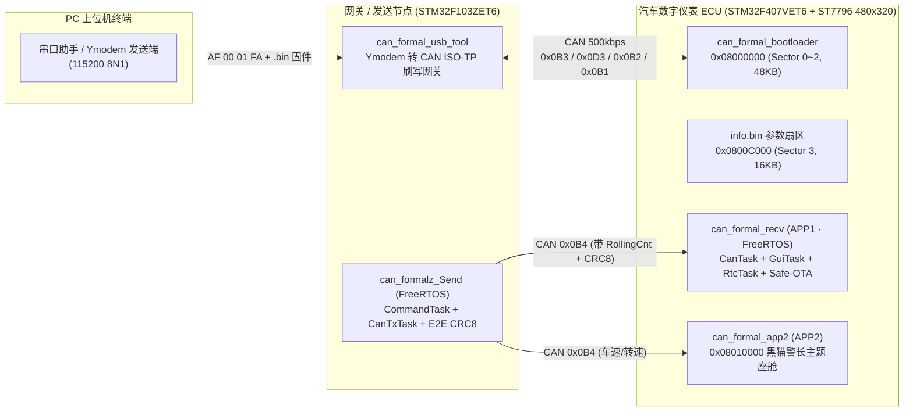
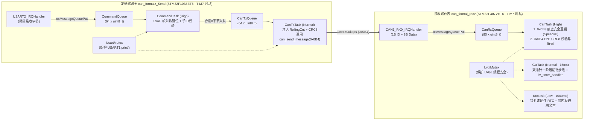

# 基于 STM32F407 + STM32F103 的车载 CAN 数字仪表盘与 ISO-TP 远程 OTA 刷写系统 (V2.0 FreeRTOS 车规升级版)

> **项目定位**：对标汽车电子 HIL（硬件在环）桌面实验台架，采用 **STM32F103ZET6（FreeRTOS 数据网关 / 刷写诊断仪）+ STM32F407VET6（FreeRTOS 汽车数字仪表 ECU）** 双节点物理 CAN 2.0B 网络架构，完整实现 **CMSIS-RTOS V2 多任务并发调度**、**LVGL 8.3.11 双主题仪表渲染**、**车规级 E2E（Rolling Counter + SAE J1850 CRC8）报文保护**、**ISO 26262 刷写前置安全互锁**、**三段式 Flash Bootloader** 以及 **Ymodem + ISO 15765-2 (ISO-TP) 跨 CAN 网络双 APP 无缝互相刷写**。

---

## 🚀 版本演进与 V2.0 核心升级说明 (Release Notes)

| 版本号 | 里程碑定位 | 核心架构与新增特性 |
| :--- | :--- | :--- |
| **V1.0** | **基础通信与跨网段 OTA 闭环** | 1. 完成 F103ZET6 ⇄ F407VET6 500kbps 物理 CAN 总线通信与 LVGL 8.3.11 双表盘 + 黑猫警长双主题 UI； 2. 实现三段式 Flash Bootloader（`0x08000000` 引导区 + `0x0800C000` 参数区 + `0x08010000` APP 区）； 3. 手写 ISO 15765-2 (ISO-TP) 多帧状态机（SF/FF/CF/FC），打通 Ymodem 转 CAN 跨网段双 APP 无限互刷。 |
| **V2.0 (当前版本)** | **双端 FreeRTOS 化 + 车规安全升级** | 1. **接收端仪表 (`can_formal_recv`) FreeRTOS 重构**：将裸机 `while(1)` 拆解为 `CanTask` (`osPriorityHigh`) + `GuiTask` (`osPriorityNormal`, 66FPS 阻尼微步进) + `RtcTask` (`osPriorityLow`) 三级任务，通过 `CanRxQueue`（90B 流式队列）与硬件 RX0 中断微秒级解耦，并以 `LvglMutex` 互斥锁保护跨线程 UI 渲染（持锁颗粒度压缩至 `<0.02ms`）； 2. **发送端网关 (`can_formalz_Send`) FreeRTOS 重构**：拆解为 `CommandTask` (`osPriorityHigh`, `0xAF` 帧头对齐状态机) + `CanTxTask` (`osPriorityNormal`, CAN 报文封包发送)，通过双队列 (`CommandQueue` / `CanTxQueue`) 与 `UsartMutex` 串口互斥锁，将 `USART2` 中断耗时从 `5.2ms` 降至 `<5μs`，根治连续发帧 ORE 溢出锁死； 3. **ISO 26262 刷写前置功能安全互锁**：仪表收到 `0x0B3` 升级请求时，强制校验车辆状态（`speed == 0 && Rpm == 0`），仅在车辆完全静止时放行进入 Bootloader；行车中拒绝升级并返回 `NRC 0x22 (ConditionsNotCorrect)` 告警，杜绝高速行车黑屏风险； 4. **车规级 E2E 总线数据保护**：在 `0x0B4` 报文 `Byte6` 引入 `0~15` 循环递增 `Rolling Counter`，`Byte7` 引入 **SAE J1850 标准 `CRC8`（多项式 `0x1D`）**，发送端自动封包、接收端硬核校验，拦截总线电磁干扰导致的错包与丢帧。 |

---

## 一、系统总体架构与通信拓扑

### 1.1 物理网络与跨网段 OTA 拓扑

```mermaid
flowchart LR
    subgraph PC["PC 上位机终端"]
        U2["串口助手 / Ymodem 发送端<br/>(115200 8N1)"]
    end

    subgraph ZET6["网关 / 发送节点 (STM32F103ZET6)"]
        SEND["can_formalz_Send (FreeRTOS)<br/>CommandTask + CanTxTask + E2E CRC8"]
        TOOL["can_formal_usb_tool<br/>Ymodem 转 CAN ISO-TP 刷写网关"]
    end

    subgraph F407["汽车数字仪表 ECU (STM32F407VET6 + ST7796 480x320)"]
        BOOT["can_formal_bootloader<br/>0x08000000 (Sector 0~2, 48KB)"]
        PARAM["info.bin 参数扇区<br/>0x0800C000 (Sector 3, 16KB)"]
        APP1["can_formal_recv (APP1 · FreeRTOS)<br/>CanTask + GuiTask + RtcTask + Safe-OTA"]
        APP2["can_formal_app2 (APP2)<br/>0x08010000 黑猫警长主题座舱"]
    end

    U2 -->|"AF 00 01 FA + .bin 固件"| TOOL
    SEND -->|"CAN 0x0B4 (带 RollingCnt + CRC8)"| APP1
    SEND -->|"CAN 0x0B4 (车速/转速)"| APP2
    TOOL <-->|"CAN 500kbps<br/>0x0B3 / 0x0D3 / 0x0B2 / 0x0B1"| BOOT
```

### 1.2 双端 FreeRTOS 多任务与 IPC 通信架构

```mermaid
flowchart LR
    subgraph TX["发送端网关 can_formalz_Send (STM32F103ZET6 · TIM7 时基)"]
        U2_ISR["USART2_IRQHandler<br/>(微秒级收字节)"] -->|"osMessageQueuePut"| Q_CMD["CommandQueue<br/>(64 x uint8_t)"]
        Q_CMD --> T_CMD["CommandTask (High)<br/>0xAF 帧头防错位 + 子ID校验"]
        T_CMD -->|"合法8字节入队"| Q_TX["CanTxQueue<br/>(64 x uint8_t)"]
        Q_TX --> T_CANTX["CanTxTask (Normal)<br/>注入 RollingCnt + CRC8<br/>调用 can_send_message(0x0B4)"]
        M_UART["UsartMutex<br/>(保护 USART1 printf)"] -.-> T_CMD
        M_UART -.-> T_CANTX
    end

    subgraph RX["接收端仪表 can_formal_recv (STM32F407VET6 · TIM7 时基)"]
        CAN_ISR["CAN1_RX0_IRQHandler<br/>(1B ID + 8B Data)"] -->|"osMessageQueuePut"| Q_RX["CanRxQueue<br/>(90 x uint8_t)"]
        Q_RX --> T_CAN["CanTask (High)<br/>1. 0x0B3 静止安全互锁 (Speed=0)<br/>2. 0x0B4 E2E CRC8 校验与解码"]
        T_GUI["GuiTask (Normal · 15ms)<br/>双指针一阶阻尼微步进 + lv_timer_handler"]
        T_RTC["RtcTask (Low · 1000ms)<br/>锁外读硬件 RTC + 锁内极速刷文本"]
        M_LVGL["LvglMutex<br/>(保护 LVGL 线程安全)"] -.-> T_CAN
        M_LVGL -.-> T_GUI
        M_LVGL -.-> T_RTC
    end

    T_CANTX ==>|"CAN 500kbps (0x0B4)"| CAN_ISR
```

---

## 二、硬件平台、BOM 物料清单与完整引脚接线表

### 2.1 核心硬件选型与 BOM 清单

| 模块角色 | 硬件型号 / 规格 | 数量 | 核心参数与用途说明 |
| :--- | :--- | :---: | :--- |
| **汽车仪表主控 ECU** | **STM32F407VET6 开发板**（立创天空星） | 1 | Cortex-M4F 内核，主频 **168 MHz**，512 KB Flash，192 KB SRAM，硬件浮点单元 (FPU) 加速 LVGL 指针旋转渲染 |
| **数据网关 / 发送节点** | **STM32F103ZET6 开发板** | 1 | Cortex-M3 内核，主频 **72 MHz**，512 KB Flash，64 KB SRAM，负责 UART(Ymodem) ⇄ CAN(ISO-TP) 协议转换与车辆状态广播 |
| **车载液晶显示屏** | **3.5 寸 TFT-LCD (ST7796S)** | 1 | 分辨率 **480 × 320**（横屏 RGB565），通过硬件 **SPI1 (42 Mbit/s)** 极速刷屏 |
| **CAN 总线收发器** | **SN65HVD230 / TJA1050 模块** | 2 | 将 MCU 的 `CAN_TX/RX` TTL 逻辑电平转换为差分物理信号 `CANH / CANL`（两端并联 120Ω 终端电阻） |
| **串口通信模块** | **USB-TTL 模块 (CH340 / CP2102)** | 1~3 | 连接网关 `USART2` 发送 Ymodem 升级固件与控制指令，可选接 `USART1` / F407 `USART2` 查看实时调试日志 |

---

### 2.2 接收端仪表 ECU（`STM32F407VET6`）完整引脚接线表

#### （1）3.5 寸 ST7796S SPI 液晶屏接线（硬件 SPI1 + GPIO 控制）

| 屏幕引脚 | STM32F407VET6 引脚 | 外设 / 模式 | 功能说明 |
| :--- | :---: | :--- | :--- |
| **`VCC`** | **`3.3V / 5V`** | 电源 | 屏幕供电 |
| **`GND`** | **`GND`** | 电源地 | 共地 |
| **`SCK` (SCL)** | **`PA5`** | `SPI1_SCK` (AF5) | 硬件 SPI1 串行时钟（42 MHz） |
| **`SDA` (MOSI)`** | **`PA7`** | `SPI1_MOSI` (AF5) | 硬件 SPI1 主机输出数据 |
| **`CS`** | **`PD1`** | `GPIO_Output` | 液晶屏片选信号（低电平有效） |
| **`RES` (RST)** | **`PD4`** | `GPIO_Output` | 液晶屏硬件复位引脚 |
| **`DC` (RS)** | **`PD15`** | `GPIO_Output` | 数据 / 命令选择引脚（高=数据，低=命令） |
| **`BLK`** | **`PE8`** | `GPIO_Output` | 液晶屏背光控制引脚 |

#### （2）CAN 收发器与调试串口接线（`STM32F407VET6`）

| 外设功能 | STM32F407VET6 引脚 | 对接目标模块引脚 | 波特率 / 参数说明 |
| :--- | :---: | :--- | :--- |
| **`CAN1_RX`** | **`PB8`** (AF9) | F407 侧 CAN 收发器 **`RXD (R)`** | **500 kbps**（APB1=42MHz, Prescaler=7, BS1=9TQ, BS2=2TQ, 采样点 83.33%，中断优先级 5） |
| **`CAN1_TX`** | **`PB9`** (AF9) | F407 侧 CAN 收发器 **`TXD (D)`** | 同上 |
| **`USART2_TX`** | **`PA2`** (AF7) | USB-TTL 的 **`RXD`** | **115200 8N1**（打印 Bootloader、Safe-OTA 互锁与 E2E 校验日志，可选接） |
| **`USART2_RX`** | **`PA3`** (AF7) | USB-TTL 的 **`TXD`** | 同上 |

---

### 2.3 网关 / 发送节点（`STM32F103ZET6`）完整引脚接线表

| 外设功能 | STM32F103ZET6 引脚 | 对接目标模块引脚 | 波特率 / 参数与用途说明 |
| :--- | :---: | :--- | :--- |
| **`USART2_TX`（主通道）** | **`PA2`** | 电脑 USB-TTL 的 **`RXD`** | **115200 8N1（必接）**：向电脑输出 `Waiting for the file...` 及 Ymodem `C` 握手信号 |
| **`USART2_RX`（主通道）** | **`PA3`** | 电脑 USB-TTL 的 **`TXD`** | **115200 8N1（必接）**：接收 `AF 00 01 FA` 升级指令、Ymodem `.bin` 固件包，或 `0xAF` 仪表控制指令（中断优先级 5） |
| **`CAN1_RX`** | **`PA11`** | ZET6 侧 CAN 收发器 **`RXD (R)`** | **500 kbps**（APB1=36MHz, Prescaler=6, BS1=9TQ, BS2=2TQ, 采样点 83.33%） |
| **`CAN1_TX`** | **`PA12`** | ZET6 侧 CAN 收发器 **`TXD (D)`** | 同上 |
| **`USART1_TX`（日志口）** | **`PA9`** | 第二个 USB-TTL 的 **`RXD`** | **115200 8N1（可选）**：打印网关内部进度或 `[CAN TX OK] Sub-ID, Cnt, CRC8` 状态回显 |
| **`USART1_RX`（日志口）** | **`PA10`** | 第二个 USB-TTL 的 **`TXD`** | 同上 |

#### 双板 CAN 总线物理互联：
* **ZET6 收发器 `CANH` ── 接 ── F407 收发器 `CANH`**
* **ZET6 收发器 `CANL` ── 接 ── F407 收发器 `CANL`**
* **ZET6 的 `GND` ── 接 ── F407 的 `GND`**

---

## 三、五大正式工程目录说明

| 工程文件夹 | 目标芯片 | Flash 起始地址 | 核心职责与功能说明 |
| :--- | :--- | :--- | :--- |
| [`can_formal_bootloader`](./can_formal_bootloader) | `STM32F407VET6` | `0x08000000` (48 KB) | **接收端 Bootloader（极简裸机）**：上电校验 Sector 3 (`0x0800C000`) 的 `ota_flag`；`ota_flag=0` 时校验栈顶 `MSP` 并跳转 `0x08010000`；`ota_flag=1` 时擦除 Sector 4~7、回复 `0x0D3` 应答、运行 ISO-TP 服务接收 2KB 固件块写入 Flash。 |
| [`can_formal_recv`](./can_formal_recv) | `STM32F407VET6` | `0x08010000` (448 KB) | **APP1（FreeRTOS 双表盘数字仪表）**：含 `CanTask`/`GuiTask`/`RtcTask` 三任务、`CanRxQueue` 队列与 `LvglMutex` 互斥锁；支持 **E2E CRC8 校验**与 **ISO 26262 静止刷写安全互锁**（仅当 `speed==0 && Rpm==0` 时响应 `0x0B3` 置位 `ota_flag=1` 软复位）。附带完整重构文档 [`FreeRTOS_Dashboard_Migration_Guide.md`](./can_formal_recv/FreeRTOS_Dashboard_Migration_Guide.md)。产物：[`APP_Car.bin`](./can_formal_recv/APP_Car.bin)。 |
| [`can_formal_app2`](./can_formal_app2) | `STM32F407VET6` | `0x08010000` (448 KB) | **APP2（黑猫警长主题 LVGL 座舱）**：50FPS 动态座舱渲染、CAN `0x0B4` 在线联动与离线巡航演示；同样支持收到 `0x0B3` 置位 `ota_flag=1` 软复位回 Bootloader，实现 **APP1 ⇄ APP2 无限次互升**。产物：[`app2_agy.bin`](./can_formal_app2/app2_agy.bin)。 |
| [`can_formal_usb_tool`](./can_formal_usb_tool) | `STM32F103ZET6` | `0x08000000` (512 KB) | **CAN OTA 升级网关**：串口 2 (`PA2/PA3`) 接收电脑 `AF 00 01 FA` 握手指令，发送 `0x0B3` 唤醒 F407 并等待 `0x0D3` 擦除完成应答，随后通过 Ymodem 接收 `.bin` 文件并按 2048B 分块经 ISO-TP (`0x0B2`) 刷写 F407。 |
| [`can_formalz_Send`](./can_formalz_Send) | `STM32F103ZET6` | `0x08000000` (512 KB) | **车辆状态 CAN 发送端（FreeRTOS 版）**：含 `CommandTask`/`CanTxTask` 双任务、双消息队列与 `UsartMutex` 互斥锁；串口 2 接收 8 字节指令后，自动在 `Byte6` 注入 `0~15` 滚动计数、`Byte7` 注入 **SAE J1850 `CRC8`**，封装为 `0x0B4` 标准帧广播至 CAN 总线。 |

---

## 四、STM32F407VET6 内部 Flash 分区设计

| 扇区编号 | 地址范围 | 容量 | 分区角色 | 关键设计说明 |
| :--- | :--- | :--- | :--- | :--- |
| **Sector 0 ~ 2** | `0x08000000 ~ 0x0800BFFF` | 48 KB | **Bootloader 区** | 存放引导程序、Flash 擦写驱动与 ISO-TP 协议栈，升级过程中永不擦除，确保断电不变砖。 |
| **Sector 3** | `0x0800C000 ~ 0x0800FFFF` | 16 KB | **参数区 (`info.bin`)** | 存放 12 字节配置结构体（魔数 `AA BB CC DD` + 版本号 + `ota_flag` + 校验和），跨软复位传递升级请求。 |
| **Sector 4 ~ 7** | `0x08010000 ~ 0x0807FFFF` | 448 KB | **用户 APP 区** | 存放 `APP_Car.bin` 或 `app2_agy.bin`，APP 入口通过 `SCB->VTOR = 0x08010000` 重映射向量表并开启全局中断。 |

---

## 五、CAN 总线通信矩阵 (`500 kbps`，采样点 `83.33%`) 与 E2E 帧格式

### 5.1 CAN ID 分配表

| CAN ID | 方向 | 报文名称 | 长度 | 载荷定义与作用 |
| :--- | :---: | :--- | :---: | :--- |
| **`0x0B3`** | ZET6 → F407 | `CAN_ID_CALL_OTA` | 8 B | `BE AD BE EF 01 AA AA AA`：请求进入 OTA 升级模式（触发 F407 **ISO 26262 静止互锁校验**） `BE AD BE EF 02 AA AA AA`：通知固件传输结束，校验并跳转新 APP |
| **`0x0D3`** | F407 → ZET6 | `CAN_ID_CALL_OTA_ACK` | 8 B | `BE AD BE EF 01 AA AA AA`：F407 已通过静止互锁并擦除完 Sector 4~7，通知网关启动 Ymodem |
| **`0x0B2`** | ZET6 → F407 | `CAN_ID_OTA_SEND` | 8 B | ISO 15765-2 (ISO-TP) 首帧 (FF) 与连续帧 (CF)，每次传输 `2048B + 9B包头` |
| **`0x0B1`** | F407 → ZET6 | `CAN_ID_OTA_RECV` | 8 B | ISO 15765-2 (ISO-TP) 流控帧 (FC)，控制网关发送节奏 |
| **`0x0B4`** | ZET6 → F407 | `CAN_ID_UI` | 8 B | `Byte0=0xAF` + `Byte1=子功能(0x01~0x07)` + `Byte2~5=参数` + **`Byte6=RollingCnt(0~15)`** + **`Byte7=CRC8(0x1D)`** |

### 5.2 `0x0B4` 车辆控制指令矩阵（上位机串口 2 输入 vs CAN 总线 E2E 帧）

> **说明**：上位机串口助手发送 8 字节指令时，末尾 2 字节可直接填任意占位符（如 `AA AA`），`can_formalz_Send` 的 `CanTxTask` 会在发射前自动计算并覆写 `Byte6 (Rolling Counter)` 与 `Byte7 (SAE J1850 CRC8)`。

| 子功能 (`Byte1`) | 上位机串口 2 发送示例 (HEX) | 功能说明 |
| :---: | :--- | :--- |
| **`0x01`** | `AF 01 1E 50 AA AA AA AA` | **转速与车速联动**：`0x1E (30)` → `3000 RPM`；`0x50 (80)` → `80 km/h`（发 `AF 01 00 00 AA AA AA AA` 归零解锁 OTA） |
| **`0x02`** | `AF 02 01 00 AA AA AA AA` | **水温报警灯**：`01` = 红色报警，`00` = 绿色正常 |
| **`0x03`** | `AF 03 01 00 AA AA AA AA` | **安全带指示灯**：`01` = 未系红色报警，`00` = 已系绿色正常 |
| **`0x04`** | `AF 04 01 00 AA AA AA AA` | **车灯指示灯**：`01` = 近光黄，`02` = 远光红，`00` = 正常绿 |
| **`0x05`** | `AF 05 01 00 AA AA AA AA` | **左转向灯**：`01` = 开启亮绿，`00` = 关闭暗灰 |
| **`0x06`** | `AF 06 14 1A 0B 07 AA AA` | **RTC 日期远程校准**：`0x14 (20)` 世纪，`0x1A (26)` 年，`0x0B (11)` 月，`0x07 (7)` 日 |
| **`0x07`** | `AF 07 15 1E 00 00 AA AA` | **RTC 时间远程校准**：`0x15 (21)` 时，`0x1E (30)` 分，`0x00 (00)` 秒 |

---

## 六、快速上手与 OTA 升级演示步骤

1. **首次烧录**：
   * 将 [`can_formal_bootloader`](./can_formal_bootloader) 编译生成的 `.hex` 烧录至 `STM32F407VET6`（地址 `0x08000000`），将 [`can_formal_recv`](./can_formal_recv) 烧录至 `0x08010000`。
   * 日常仪表联调烧录 [`can_formalz_Send`](./can_formalz_Send) 至 `STM32F103ZET6`；跨网段 OTA 刷写演示时烧录 [`can_formal_usb_tool`](./can_formal_usb_tool) 至 `STM32F103ZET6`。
2. **硬件接线**：
   * 两板收发器 `CANH` 接 `CANH`、`CANL` 接 `CANL`、`GND` 共地。
   * 电脑 USB-TTL 接网关板 `STM32F103ZET6` 的 **串口 2 (`PA2` TX / `PA3` RX)**，波特率 `115200 8N1`。
3. **验证 ISO 26262 刷写互锁与一键 CAN OTA 升级**：
   * 若当前仪表车速或转速不为 0（行车状态），发送 `0x0B3` 升级指令将被 F407 拦截并打印 `[Safe-OTA] REJECTED (NRC 0x22)! Vehicle moving...`。
   * 确保车辆处于静止状态（`Speed=0, RPM=0`），串口助手向 ZET6 串口 2 按 HEX 发送 `AF 00 01 FA`。
   * F407 互锁校验通过，自动软复位进入 Bootloader 并擦除 APP 扇区（耗时约 3 秒），随后电脑串口收到 `CCCCC...` 握手信号。
   * 使用 Ymodem 协议发送 [`app2_agy.bin`](./can_formal_app2/app2_agy.bin)（黑猫警长）或 [`APP_Car.bin`](./can_formal_recv/APP_Car.bin)（双表盘），进度条走完 100% 后屏幕立即点亮新主题！
